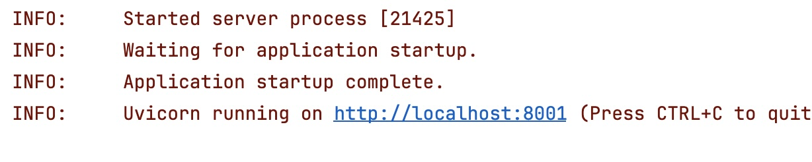
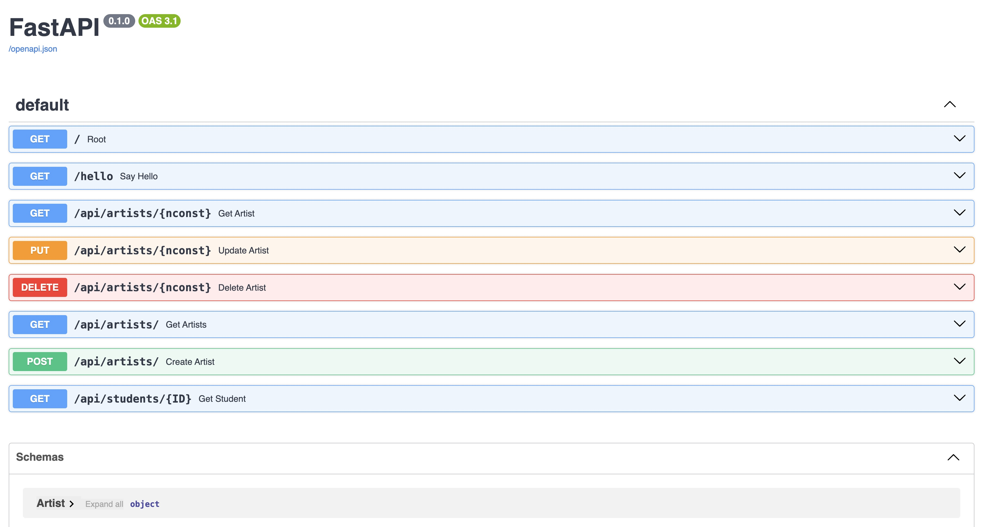

# W4111_Project_Template_V3

This is the Project Template for _W4111 - Introduction to Databases (Prof. Ferguson's section)._ This is version
4.0, 2025-MAR-09.

__Note:__ Students should go to the section 
[Sprint - 1: Installation and Environment Test.](#sprint---1-installation-and-environment-test)

# Introduction

## Database User Roles

## Data Engineer

## Application Developer

# Data Engineering Project

# Application Developer Project

# Sprints

## Sprint - 1: Installation and Environment Test

### Getting Started

1. Clone this repository.<br><br>
2. Open the project in PyCharm. The course instructions strongly recommended using PyCharm. Create and activate
a new python virtual environment.
If you are not using PyCharm, you are on your own.
   1. Create a new python virtual environment. Students should have already done this previously in  PyCharm.
You can review the [online instructions.](https://www.jetbrains.com/help/pycharm/creating-virtual-environment.html)
   2. Open a terminal window in the PyCharm.
   3. Run the command ```pip freeze > requirements.txt```.
   4. When the installation completes, close the terminal window.<br><br>
3. Navigate inside the project explorer to ```interactive_app/application```  and select the file ```main.py```.<br><br>
4. Right click and choose ```Run main.py```.<br><br>
5. You should see a window activate in PyCharm that will eventually display something similar to<br>
<br><br>
6. In a browser, enter ```localhost:8001/docs``` in the navigation bar. You should see something that
looks like<br>


Congratulations! You have unlocked the next level. You can close the browser window/tab and stop the
application in PyCharm.

### Jupyter Test

1. Open a terminal window in PyCharm.
2. Enter the command ```jupyter notebook```.
3. You should see several console messages and then a browser will open displaying the project's files/directories.
4. Navigate to ```common_data_engineering/Data_Engineering_Phase_1_Example.ipynb``` and start the notebook.
5. Execute the cells in _2. Initialization._ 
6. If the cells execute correctly, congratulations. You have unlocked the next level.

### Load Project Data


